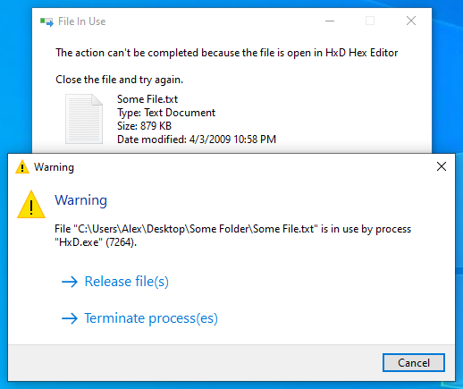
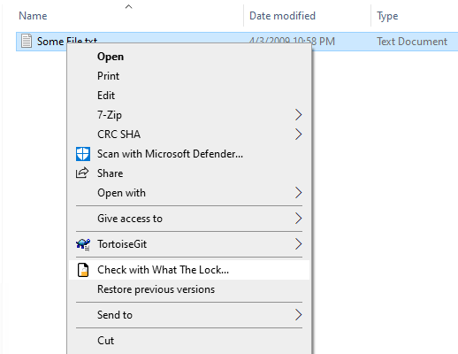

# What The Lock

What The Lock is a tool that integrates into Windows shell components (i.e. Explorer and file dialogs) to release currently locked (opened by another process) files. It checks for locks when shell components try to delete something, a context menu item is also provided.

  

  

### Features
- ...
- Built using Lazarus :fire:

### Installation
Download the installer from "Releases" and run it. What The Lock will install itself to %PROGRAMFILES%\What The Lock.

Complete uninstallation is possible using "Programs and Features".

### Building
- Install Lazarus IDE

To use the build script "Build.bat" you need to configure variables at the top of the file.

### Thanks
- [Lazarus IDE](https://www.lazarus-ide.org)
- [Free Pascal](https://www.freepascal.org)
- [Font Awesome](https://fontawesome.com) for icons
- [MahdiSafsafi](https://github.com/MahdiSafsafi) for DDetours
